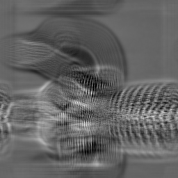

# PRaCTES session 7: high performance computing

"High performance computing" usually means writing and running parallel programs on large numbers of processors. I'm interpreting the scope of this session a little more broadly, though. The first half will focus on understanding the performance of serial programs, with an emphasis on why some programming languages produce code that is dramatically (i.e., several orders of magnitude) faster tha others. The second half will focus on understanding how parallel programs decrease program execution times and provide some practing running and interpreting benchmarks to measure the speedup produced by parallelization.

## Part 1: programming languages, compilers, and serial performance

We'll explore the performance of serial programs with a toy program based on the Collatz conjecture, which proposes that the iterative sequence

<a href="https://www.codecogs.com/eqnedit.php?latex=n&space;\rightarrow&space;n/2&space;\;\;\textrm{&space;(even&space;}&space;n&space;\textrm{)}&space;\\&space;n&space;\rightarrow&space;3n&plus;1&space;\;\;\textrm{&space;(odd&space;}&space;n&space;\textrm{)}" target="_blank"></a>

always reaches 1. For example, the starting value 6 produces a sequence (6, 3, 10, 5, 16, 8, 4, 2, 1) that eventually reaches 1 after 8 iterations. Our toy problem is the following: given some number *N*, what starting value between 1 and *N* takes the most iterations to reach 1?

The ``collatz_comparison`` folder contains a solutions to this problem written in four programming languagues: Python, C, Julia, and Java. Although all four programs produce the same answers, they run at very different speeds, and we'll try to understand why---but first, let's talk about how computers execute code.

### How computers execute code

Computers contain a large bank of memory ("random access memory", or RAM), which can typically holds several GB of data, and one or more processors. The processors themselves contain several much smaller banks of memory (called "registers"), which hold just 64 bits of data on most modern computers, and circuits of transistors that can perform basic arithmetic and logic operations on values stored in the registers. Ultimately, all programs run by executing sequences of instructions ("machine code") that manipulate data in registers and move data between registers and RAM.

For example, a function that adds two integers
```C
int add(int a, int b) {
   return a + b;
}
```
might be converted to a sequence of instructions that looks something like
```
load a, r1          (load a from memory into register 1)
load b, r2          (load b from memory into register 2)
add r1, r2, r3      (add the data in registers 1 and 2 and store the result in register 3)
store r3, retval    (store the data in register 3 in a special "return value" location in RAM)
```

Different types (or "architectures") of processors use different instructions sets, so the same program will be converted to different machine code if it runs on e.g. an Intel processor (which uses the x86 instruction set) and an IBM processor (which uses the Power instruction set). Generally speaking, programs will run more quickly if they require a relatively short sequence of instructions.

### Language 1: Python

Python programs are never converted directly to machine code. Instead, they are translated into machine-independent code objects that run on the "Python virtual machine"---which is itself a program, often written in C. Because the translation process doesn't depend on the instruction set used by the computer hardware, the Python virtual machine makes it much easier to run Python on a variety of processor architectures. However, the extra layer of software between the program and the hardware introduces some overhead that slows program execution.

Start a Python REPL and measure the time to solution for *N* = 1,000,000 by running
```python
>>> from collatz import *
>>> import timeit
>>> def benchmark():
...    find_longest_sequence(1000000)
>>> timeit.timeit(benchmark, number = 1)
```
This takes 1-2 minutes on my laptop and tells me that the longest sequence starts from 837,799 and reaches 1 after 524 iterations.

### Language 2: C

C is a compiled language. This means that C programs are first converted all the way to machine code by running them through a program called a compiler, and the machine code is then executed directly by the processor. This avoids virtual machine overhead and produces programs that execute quickly. However, it also requires developing and maintaining many versions of the C compiler, since a different version is required for every processor architecture.

From the command line, compile the C program and measure the time to solution for *N* = 1,000,000 by running
```bash
$ gcc collatz.c -o collatz
$ time ./collatz 1000000
```
This takes around 1 second on my laptop---much faster than the Python program!

These two experiments provide the basis for a hypothesis:

### Initial hypothesis: programs run faster if they compile to machine code

We are scientists, so let's test this hypothesis by collecting more data. Specifically, let's measure the time to solution in two other programming languages: Java (which runs on a virtual machine) and Julia (which is compiled to machine code).

### Language 3: Java

From the command line, compile the Java program (to machine-independent code objects, not machine code!) and run the program (with ``-Xint`` to disable just-in-time compilation to machine code).
```bash
$ javac Collatz.java
$ time java -Xint Collatz 1000000
```
On my laptop, this takes about 20 seconds.

### Language 4: Julia

Start a Julia REPL and measure the time to solution by running
```julia
julia> include("collatz.jl")
julia> find_longest_sequence(1)
julia> @time find_longest_sequence(1000000)
```
On my laptop, this also takes about 20 seconds. (The first call to ``find_longest_sequence`` is to trigger Julia's just-in-time compiler so that our measurement doesn't include the time needed for the compiler to run.)

This new data suggests that our hypothesis is incomplete. Like Python, Java runs on a virtual machine, but it runs much more quickly. Additionally, Julia runs much slower than C (and comparable to Java) even though it compiles to machine code. So what are we missing?

### Type systems and performance

Computer processors have no inherent notion of types: they can manipulate bits in registers, but they cannot tell whether the bits in a register represent an integer or a floating point number. Instead, this type information has to be encoded in the instructions used to execute a program. If we want to add two integer values, the bits in two registers must be added with an instruction for integer addition; if we want to add two floating point values, the bits in two registers must be added with an instruction for floating point addition.

C and Java are both "statically-typed" languages, which means that types are known at compile time (when machine code or machine-independent code objects are generated). As a result, a statement like ``a + b`` can be executed efficiently: with e.g. an integer addition instruction if ``a`` and ``b`` are integers, or a floating point instruction if ``a`` and ``b`` are floats.

Julia and Python, on the other hand, are "dynamically-typed", which means that types are only known once the program starts running. As a result, a statement like ``a + b`` incurs some additional overhead: the program first has to inspect the values stored inside ``a`` and ``b`` to determine their types before executing the correct addition instruction. Much like the overhead incurred by running a virtual machine, this overhead means that programs written in dynamically-typed languages often execute less quickly than programs written in statically-typed languages.

Knowing this allows us to generate a refined hypothesis:

### Refined hypothesis: programs run faster if they compile to machine code and/or if types are known at compile time

This hypothesis fits our data: 
- the Python program is slow because it is dynamically-typed and runs on a virtual machine
- the C program is fast because it is statically-typed and compiles to machine code
- the Java and Julia programs are somewhere inbetween because Java is statically-typed but runs on a virtual machine and Julia is dynamically-typed but compiles to machine code

Julia provides a way to test this hypothesis: we can modify the code to provide type hints to the compiler. This involves only minor changes; for example, a function for integer addition would change from
```julia
function add(a, b)
   return a + b
end
```
to
```julia
function add(a :: Int64, b :: Int64)
   return a + b
end
```
By adding type hints, we ask the Julia compiler to compile the ``add`` function to work for integer arguments specifically, rather than for arguments of any type. This means that we can no longer use ``add`` to add anything other than integers. However, it also means that the code generated by the compiler no longer has to inspect the values in ``a`` and ``b`` before executing the correct add instruction. If this inspection is what prevents compiled Julia code from achieving performance comparable to compiled C code, then adding type hints should allow Julia code to execute about as fast as C.

### Language 4b: Julia with type hints

Start a Julia REPL and measure the time to solution by running
```julia
julia> include("collatz_typed.jl")
julia> find_longest_sequence(1)
julia> @time find_longest_sequence(1000000)
```
On my laptop, this takes about 2 seconds---comparable to C code!

## Part 1 main points:

- If you want to write fast code, use a language that compiles to machine code **and** provide the compiler with compile-time type information.
- Julia fits both these requirements without sacrificing Python-like interactivity, plotting, and package management.
- (Python can also be quite fast if you use libraries that are implemented in C. This includes most of the scientific python stack: numpy, scipy, xarray, etc.)
- (Compiled code can become even faster, albeit at the expense of longer compile times, if you enable compiler optimizations. Try re-compiling ``collatz.c`` with ``gcc collatz.c -O3 -o collatz``.)

## Exercise 1:

[](https://mybinder.org/v2/gh/thabbott/PRACTES_HPC/master?urlpath=lab)

The ``lorenz_system`` folder contains Julia code for simulating the Lorenz system, a set of three coupled ODEs

<a href="https://www.codecogs.com/eqnedit.php?latex=\frac{\mathrm{d}x}{\mathrm{d}t}&space;=&space;\sigma&space;(y&space;-&space;x)&space;\\&space;\frac{\mathrm{d}y}{\mathrm{d}t}&space;=&space;x&space;(\rho&space;-&space;z)&space;-&space;y&space;\\&space;\frac{\mathrm{d}z}{\mathrm{d}t}&space;=&space;x&space;y&space;-&space;\beta&space;z" target="_blank"></a>

Open the ``lorenz_system`` folder (you can use the binder link above), then start a Julia console and run a simulation for 1000 time steps with
```julia
julia> include("simulations.jl")
julia> ensemble = animate_ensemble(1000)
```
This will create a large set of points in (x,y,z) with slightly different initial values that, over time, gradually disperse over a butterfly-shaped attractor. Once the animation stops, bechmark the performance of the simulation by running
```julia
julia> @time benchmark(ensemble)
```
to measure the time required to advance the model another 1000 time steps.

The simulation code you just ran doesn't include any type hints for the compiler and so runs much less quickly than it should. Your job is to speed up the simulation as much as possible by adding type hints to the code in ``lorenz.jl``. (Hint: focus initially on adding type annotations to the fields in the ``Position`` and ``LorenzEnsemble`` structs. The ``typeof`` function will probably be useful; running e.g.
```julia
julia> typeof(ensemble.N)
```
will return the type of the ``N`` field in the ``LorenzEnsemble`` struct.) Once you've added some type hints, restart the Julia console and re-benchmark the simulation to see how much faster it's become!

## Part 2: parallel computing

There are many scientific applications for which even the fastest single-processor programs aren't fast enough. In these cases, we can turn to parallel programs that share the work of a computation among multiple processors.

We're going to organize our discussion of parallel computing around a model (written in C) that simulates the shallow water equations. The model initializes itself by reading an image and using it to create ripples on the water surface. The ripples quickly disperse into a field of waves (left two images) and, on much longer timescales, the fluid itself is rearranged (right two images, with the GIF accelerated 100x).

</img>
</img>
</img>
</img>

This model can be run on several processors in parallel by splitting the model domain into several chunks and assigning one processor to each chunk. The parallelism is controlled by setting parameters on lines 14-17 of ``loon.c``:
```C
int KX = 256;                       // Grid points per processor (x)
int KY = 256;                       // Grid points per processor (y)
int px = 1;                         // Processors (x)
int py = 1;                         // Processors (y)
```
``KX`` and ``KY`` control the number of model grid points controlled by each processor, and ``px`` and ``py`` control the number of chunks that the x- and y-dimensions of the domain are split into. For the model to work correctly, ``KX*px`` must be equal to the height (in pixels) of the input image, and ``KX*py`` must be equal to the input image width. Additionally, the model must be run (after compiling) on the correct number of processors using the commands
```bash
$ make
$ mpirun -n N ./loon
```
with the parameter ``N`` equal to ``px*py``.

The model is configured so that each processor writes its own output images when run in parallel, and looking at these images can help to clarify how changing parameters in ``loon.c`` re-distributes work over one or more processors. The following images show that model height field after 30 timesteps on 1, 2, 4, and 8 processors.

#### 1 processor
```C
int KX = 256;                       // Grid points per processor (x)
int KY = 256;                       // Grid points per processor (y)
int px = 1;                         // Processors (x)
int py = 1;                         // Processors (y)
```
```bash
$ make
$ mpirun -n 1 ./loon
```
</img>

#### 2 processors
```C
int KX = 128;                       // Grid points per processor (x)
int KY = 256;                       // Grid points per processor (y)
int px = 2;                         // Processors (x)
int py = 1;                         // Processors (y)
```
```bash
$ make
$ mpirun -n 2 ./loon
```
</img></br>
</img>

#### 4 processors
```C
int KX = 128;                       // Grid points per processor (x)
int KY = 128;                       // Grid points per processor (y)
int px = 2;                         // Processors (x)
int py = 2;                         // Processors (y)
```
```bash
$ make
$ mpirun -n 4 ./loon
```
</img>
</img></br>
</img>
</img>

#### 8 processors
```C
int KX = 64;                        // Grid points per processor (x)
int KY = 128;                       // Grid points per processor (y)
int px = 4;                         // Processors (x)
int py = 2;                         // Processors (y)
```
```bash
$ make
$ mpirun -n 8 ./loon
```
</img>
</img></br>
</img>
</img></br>
</img>
</img></br>
</img>
</img></br>

### Parallel performance

How should we expect parallelization to impact the performance of the shallow water model? If we define the speedup (*s*) introduced by parallelization as the ratio of the computation time with *N* processors to the computation time with one processor, and we assume that

1. the total problem size (model resolution and number of time steps) is the same regardless of the number of processors,
2. the entire computation can be parallelized,
3. the computational load can be perfectly balanced across all processors, and
4. parallelization doesn't introduce any additional overhead,

then we expect that *s* = *N* (i.e. the program should run twice as fast with 2 processors, 4 times as fast with 4 processors, and so on). This level of speedup (*s* = *N* with a fixed problem size) is called "perfect strong scaling".

In reality, however, parallelizing the shallow water model *does* introduce some additional overhead in the form of communication between different processors. Updating the model state at a single grid point requires information from neighboring gridpoints, and for grid points on the perimeter of one processor's portion of the model domain, some of this information is held by a different processor. Because of this, processors have to periodically stop "useful" computation to send data to and receive data from other processors. This communication takes time and slows the overall execution of the program.

In the shallow water model, communication overhead scales with the total perimeter length of processor subdomains. Even with a fixed problem size, the total perimeter length increases as more and more processors are added. The resulting increase in communication overhead will prevent the model from achieving perfect strong scaling with an arbitrarily large number of processors, and once communication overhead dominates the total computation time, adding more processors will no longer result in a speedup. We will explore the strong scaling of the shallow water model more in exercise 2.

## Part 2 main points:

## Exercise 2:

